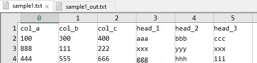
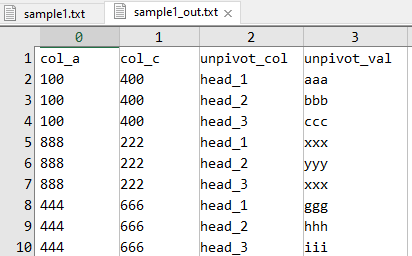

# Unpivotdude

Unpivotdude is a utility to unpivot data from an input file in a user-desired way.

Unpivotdude can be ran manually, or integrated into an automated-process/work-flow.  In general it follows the [UNIX philosophy](https://en.wikipedia.org/wiki/Unix_philosophy) much as possible.

Note: This is the converse-utility of the tool *pivotdude*, which can be found [here](https://github.com/chipnetics/pivotdude)

# Project Motivation

We can accomplish pivoting data in multiple ways; however, for most individuals, they typically do it in Excel. The problem with Excel is that to pivot against a combination of columns, things become clunky fast; they append together values to get unique column combinations, pivot tables become nested/indented and need reformatting, processing hangs on vast data (and may not even work when beyond ~50,000 line items), and so forth. Of course, it also goes without saying this process is difficult to automate and is not workable on large data sets.

Unpivotdude is a command line approach to easily take tab-separated values from a file and output to standard output (stdout) the data transformation.

# Pre-Compiled Binaries

Binaries (.exe) for Windows OS have been pre-compiled and can be found in the 'bin' folder.

With git, you can download all the latest source and binaries with `git clone https://github.com/chipnetics/unpivotdude`

Alternatively, if you don't have git installed:

1. Download the latest release [here](https://github.com/chipnetics/unpivotdude/releases/)
2. Unzip to a local directory.
3. Navigate to 'bin' directory for executables.

# Compiling from Source

Utilities are written in the V programming language and will compile under Windows, Linux, and MacOS.

V is syntactically similar to Go, while equally fast as C.  You can read about V [here](https://vlang.io/).

Each utility is its own .v file, so after installing the [latest V compiler](https://github.com/vlang/v/releases/), it's as easy as executing the below.  _Be sure that the V compiler root directory is part of your PATH environment._

```
git clone https://github.com/chipnetics/unpivotdude
cd src
v build unpivotdude.v
```
Alternatively, if you don't have git installed:

1. Download the bundled source [here](https://github.com/chipnetics/unpivotdude/archive/refs/heads/main.zip)
2. Unzip to a local directory
3. Navigate to src directory and run `v build unpivotdude.v`

Please see the [V language documentation](https://github.com/vlang/v/blob/master/doc/docs.md) for further help if required.

# Viewing Large Files

As an aside, the author recommends the excellent tool _EmEditor_ by Emurasoft for manually editing or viewing large text-based files for data science & analytics. Check out the tool [here](https://www.emeditor.com/).  _EmEditor_ is paid software but well worth the investment to increase effeciency.

# Running Command Line Arguments

For Windows users, if you want to pass optional command line arguments to an executable:

1. Navigate to the directory of the utility.
2. Hold Shift + Right Mouse Click.
3. Select "Open PowerShell Window Here".
4. Type the name of the exe along with the optional argument (i.e. `./unpivotdude.exe [OPTIONS]` ).

# Command Line Options

```
Usage: unpivotdude [options] [ARGS]

Description:
Unpivot input data on specific column combination.
Note that columns are 0-index based.

Options:
  -p, --pivot <string>      Comma-separated list of pivot indexes.
  -h, --header <string>     Comma-separated list of header indexes.
  -n, --no-header           Indicate input file has no header.
  -f, --file-in <string>    Input file to pivot.
  -h, --help                display this help and exit
  --version                 output version information and exit
```

_Note that the -p and -h options can be passed individual column indexes, or ranges of indexes (i.e. 3-5). See the example below._

***

# Examples

----

`unpivotdude.exe -f ..\..\examples\sample1.txt -p 0,2 -h 3-5 > ..\..\examples\sample1_out.txt`

**sample1.txt :::**



**sample1_out.txt :::**

